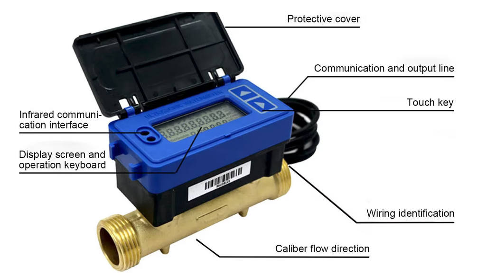
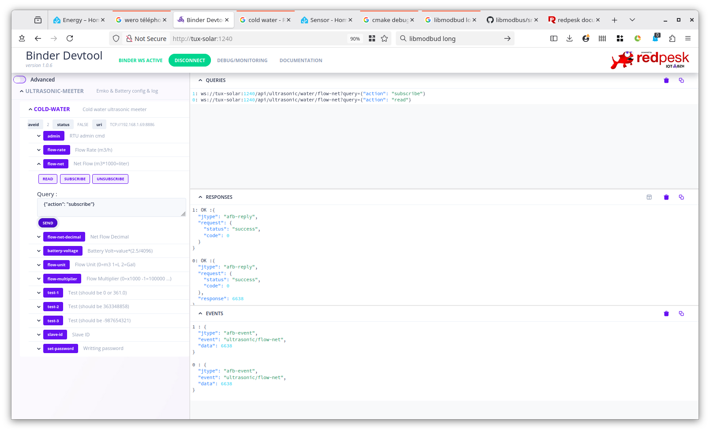
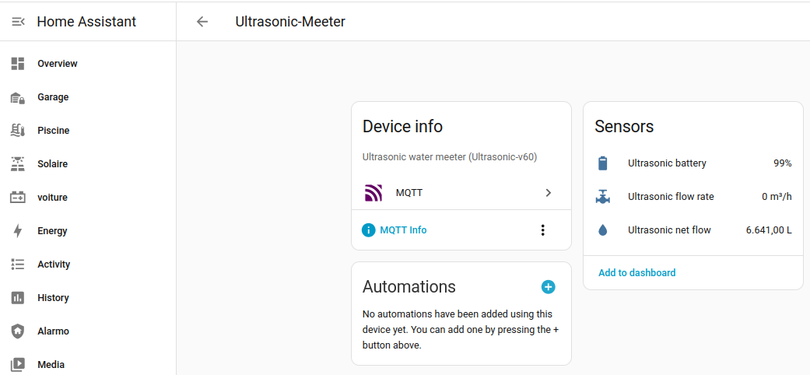
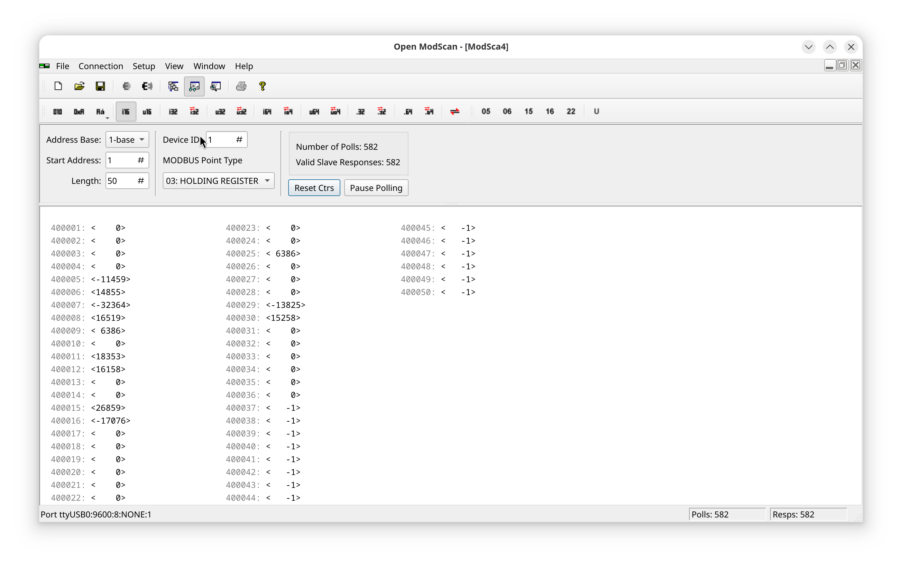

# Ultrasonic Modbus Water meeter redpesk binding

### Modbus TTY config:
 * baud: 9600
 * parity: none
 * slave-id: 1

### Device configuration:
 * slave-id register: reg@61 (Primary communication Address)
 * connect with RS485/TCP cable or RS485/TCP/RTU gateway
 * check connectivity with OpenModScan or equivalent Modbus debug tool

### WARNING: Ultrasonic/V60 PDF documentation is [partially] accurate
 * register are express as index and not addressed. You should remove 1 to get a valid modbus address
 * 32 bits integer are in reverse order (no standard API on linux/libmodbus)
 * 32 bits float are in FLOAT_CDAB 
 * Some registers do not match with documentation ex:product-id, temperature, ...
 * I fail changing flow unit from M3 to litter (modbus write refused)

### afb-binder configuration files

* etc/modbus-ultrasonic-meeter.yaml: describes working sensors (warning set slave-id to your configured value)
* etc/mqtt-ultrasonic-meeter.yaml: publish net-flow through mqtt
* homeassistant/sensors/ultrasonic-mqtt-sensors.yaml: create ultrasonic sensor without HA MQTT group
* systemd/ultrasonic.service: systemd startup service 

### debug

Check test-(1,2,3) api from devtools should return defined fix values for uint/int/float

### Connection

### Debug UI

### Home-Assistant

### Modbus scan

A nice tool to scan modbus registers: https://github.com/sanny32/OpenModScan/releases

